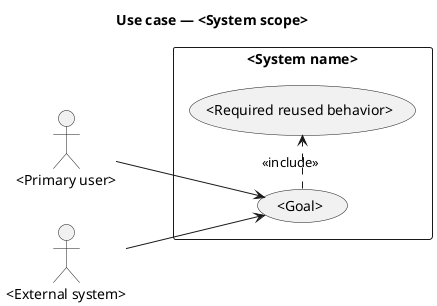
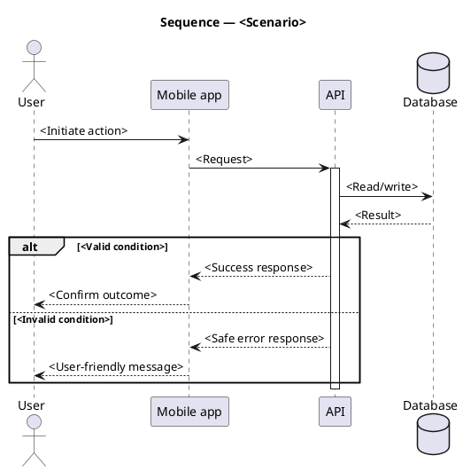
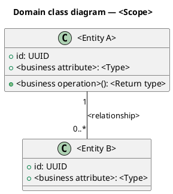
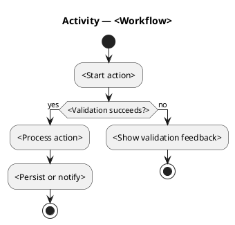
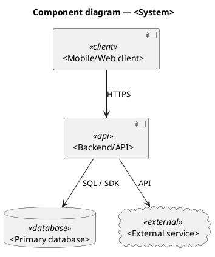

# PlantUML Templates

Replace every placeholder with project-specific terminology. Remove optional elements unsupported by evidence.

## Use Case



## Sequence



## Class



## Activity



## Component



## Deployment

```plantuml
@startuml
title Deployment diagram — <System>
node "User device" { artifact "<Mobile app or browser>" as Client }
cloud "<Hosting platform>" { node "<Application runtime>" { artifact "<API service>" as Api } }
cloud "<Managed database platform>" { database "<Database>" as Db }
Client --> Api : HTTPS
Api --> Db : authenticated connection
@enduml
```
