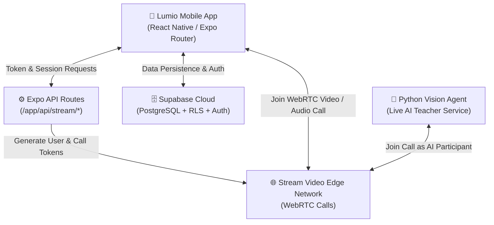

<div align="center">

# Lumio

**Light up a new language.**

An AI-powered language learning mobile application featuring real-time conversational video AI tutors, gamified interactive practices, and persistent mastery analytics.

[](https://expo.dev)
[](https://reactnative.dev)
[](https://www.typescriptlang.org)
[](https://nativewind.dev)
[](https://supabase.com)
[](https://getstream.io)
[](https://jestjs.io)
[](LICENSE)

</div>

---

## 📖 Table of Contents

- [Overview](#-overview)
- [Key Features](#-key-features)
- [System Architecture](#-system-architecture)
- [Tech Stack](#-tech-stack)
- [Project Directory Layout](#-project-directory-layout)
- [Getting Started](#-getting-started)
  - [Prerequisites](#prerequisites)
  - [Environment Configuration](#environment-configuration)
  - [Running the Mobile App](#running-the-mobile-app)
  - [Running the Python Vision Agent](#running-the-python-vision-agent)
  - [Database & Migrations](#database--migrations)
- [Testing & Quality Assurance](#-testing--quality-assurance)
- [License](#-license)

---

## 🌟 Overview

**Lumio** is designed to bridge the gap between traditional gamified vocabulary drills and real-life conversational fluency. By integrating **GetStream WebRTC Video** with an autonomous **Python Vision Agent**, Lumio allows learners to interact with a responsive AI teacher 1-on-1 via live video and audio, receive real-time feedback, and master grammar through engaging interactive practice modes.

---

## ✨ Key Features

### 🤖 Real-Time AI Video Tutoring
- **1-on-1 WebRTC Calls**: Practice speaking face-to-face with an intelligent AI teacher avatar powered by Stream Video SDK.
- **Vision-Aware AI Agent**: The Python Vision Agent processes live audio and visual context to assess pronunciation, sentence structure, and vocabulary.
- **Auto-Completion & Rewards**: Sessions automatically evaluate and complete lessons upon conclusion, immediately updating student XP and streaks.

### 🧩 Dynamic Practice Modes
- **Translation & Sentence Builder**: Reassemble sentences using interactive, tap-based word banks with instant grammar and syntax validation.
- **Multiple Choice Quizzes**: Quick-fire comprehension drills designed to reinforce vocabulary and contextual meaning.
- **Unified Activity Interface**: Consistent, accessible card components for seamless switching between lessons and drills.

### 🔥 Gamification & Habit Loop
- **Streak & XP Engine**: Track daily learning habits, maintain streaks, and level up with earned XP.
- **Mastery Analytics**: Detailed profile screen showing accuracy percentages, total lessons cleared, and practice milestones.

### 🔒 Enterprise-Grade Persistence
- **Supabase PostgreSQL & Auth**: Robust email and OAuth authentication with strict Row-Level Security (RLS) ensuring total data privacy.
- **Offline Tolerance**: Optimistic UI and local caching backed by Zustand and AsyncStorage.

---

## 🏗️ System Architecture



---

## 🛠️ Tech Stack

| Layer | Technology | Details |
| :--- | :--- | :--- |
| **Mobile Framework** | [Expo](https://expo.dev) (SDK 54) / [React Native](https://reactnative.dev) (0.81.5) | React 19, Expo Router v6 (Typed file-based routing) |
| **Styling** | [NativeWind](https://nativewind.dev) / [Tailwind CSS v4](https://tailwindcss.com) | Utility-first universal CSS styling |
| **Typography & Fonts** | Google Fonts | `Fredoka`, `Plus Jakarta Sans`, `JetBrains Mono` |
| **State Management** | [Zustand](https://github.com/pmndrs/zustand) + AsyncStorage | Global client state with local persistence |
| **Backend & Database** | [Supabase](https://supabase.com) | PostgreSQL, Supabase Auth, Row Level Security (RLS) |
| **Video & Realtime** | [Stream Video SDK](https://getstream.io/video/) | `@stream-io/video-react-native-sdk`, WebRTC |
| **AI Vision Service** | Python 3.10+, `uv`, Vision LLMs | Stream Python SDK, real-time video/audio processing |
| **Testing** | [Jest](https://jestjs.io), Testing Library | `@testing-library/react-native`, Unit & Component tests |

---

## 📂 Project Directory Layout

```
lumio/
├── app/                      # Expo Router navigation routes
│   ├── (auth)/               # Login, register, and onboarding screens
│   ├── (tabs)/               # Main tab screens (learn, practice, profile)
│   ├── api/                  # Server-side API routes (Stream tokens, sessions)
│   ├── lesson/               # Video & audio lesson call screens
│   └── _layout.tsx           # Global root layout, font loading & providers
├── components/               # Modular UI components
│   ├── auth/                 # Authentication forms & social buttons
│   ├── learn/                # Lesson cards & section list
│   ├── practice/             # Translation & multiple choice quiz modals
│   ├── profile/              # User stats, achievements & settings actions
│   └── ui/                   # Reusable atomic UI (ActivityCard, Button, etc.)
├── constants/                # Colors, typography, and static configurations
├── data/                     # Hardcoded lesson curriculums & mock datasets
├── hooks/                    # Custom hooks (useAuth, usePracticeData, etc.)
├── lib/                      # Supabase client, Stream helpers & utilities
├── store/                    # Zustand stores (user settings, learning state)
├── supabase/                 # PostgreSQL migrations and seed scripts
├── types/                    # Shared TypeScript interfaces & models
├── vision-agent/             # Python AI Vision Agent service
│   ├── agent.py              # Main vision agent participant logic
│   ├── Dockerfile            # Container configuration for deployment
│   └── pyproject.toml        # Python project specifications (uv)
└── __tests__/                # Comprehensive Jest test suites
```

---

## 🚀 Getting Started

### Prerequisites

Ensure the following tools are installed on your machine:
- **Node.js**: `v18.x` or higher ([Node.js Download](https://nodejs.org/))
- **npm** or **yarn** / **pnpm**
- **Python**: `3.10` or higher with [`uv`](https://docs.astral.sh/uv/) installed
- **Expo CLI**: Included with project dependencies
- **Mobile Development Environment**:
  - iOS: macOS with Xcode and CocoaPods (or Expo Go / Dev Client)
  - Android: Android Studio with Android SDK and Emulator configured

---

### Environment Configuration

#### 1. Mobile App & API Routes (`.env.local`)
Create a `.env.local` file in the root directory:

```env
# Supabase Configuration
EXPO_PUBLIC_SUPABASE_URL=https://your-project.supabase.co
EXPO_PUBLIC_SUPABASE_ANON_KEY=your-supabase-anon-key

# Stream Video Configuration
EXPO_PUBLIC_STREAM_API_KEY=your-stream-api-key
STREAM_API_SECRET=your-stream-api-secret

# Server API Configuration (if applicable)
API_BASE_URL=http://localhost:8081
```

#### 2. Python Vision Agent (`vision-agent/.env`)
Create a `.env` file in the `vision-agent/` directory:

```env
STREAM_API_KEY=your-stream-api-key
STREAM_API_SECRET=your-stream-api-secret
OPENAI_API_KEY=your-openai-api-key
```

---

### Running the Mobile App

1. **Install dependencies:**
   ```bash
   npm install
   ```

2. **Start the Expo development server:**
   ```bash
   npx expo start
   ```

3. **Run on specific platforms:**
   ```bash
   # Android Emulator / Device
   npm run android

   # iOS Simulator / Device (macOS only)
   npm run ios

   # Web Preview
   npm run web
   ```

---

### Running the Python Vision Agent

The AI Teacher agent joins video calls initiated by the mobile app.

1. **Navigate to the agent directory:**
   ```bash
   cd vision-agent
   ```

2. **Sync dependencies using `uv`:**
   ```bash
   uv sync
   ```

3. **Start the Vision Agent:**
   ```bash
   uv run agent.py
   ```

*(Alternatively, run using Docker: `docker build -t lumio-agent . && docker run --env-file .env lumio-agent`)*

---

### Database & Migrations

Lumio utilizes Supabase PostgreSQL. Database schemas, content tables, and prompt migrations are organized in `supabase/migrations/`:

- `20260811000000_add_content_tables_and_seed.sql`: Creates core tables (lessons, vocabulary, user progress) and seeds default lessons.
- `20260817000000_update_lesson_ai_teacher_prompts.sql`: Configures prompt templates and instructions for the AI Vision Teacher.

Apply migrations via the [Supabase CLI](https://supabase.com/docs/guides/cli):
```bash
supabase db reset
```

---

## 🧪 Testing & Quality Assurance

Lumio maintains strict test coverage across unit logic, custom hooks, and UI components.

```bash
# Run all Jest unit & component tests
npm test

# Run tests in watch mode
npm test -- --watch

# Run TypeScript type validation
npm run typecheck

# Run ESLint validation
npm run lint

# Run Vision Agent Python tests
cd vision-agent && uv run pytest
```

---

## 📄 License

This project is licensed under the MIT License — see the [LICENSE](LICENSE) file for details.
