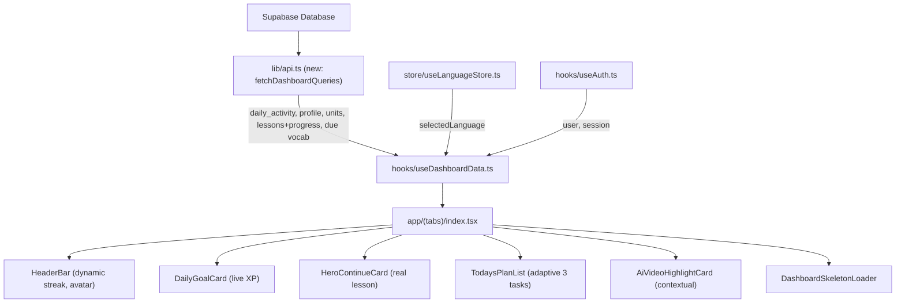

# Design Spec: Dynamic, Reactive & Responsive Dashboard for Lumio

- **Date:** 2026-08-19
- **Status:** In Review
- **Author:** Antigravity (AI Pair Engineer)
- **Target:** `app/(tabs)/index.tsx`, `components/home/*`, `hooks/useDashboardData.ts`, `lib/api.ts`, `types/home.ts`

---

## 1. Overview & Objectives

Currently, the Lumio Dashboard ([`app/(tabs)/index.tsx`](file:///D:/projects/lumio/app/(tabs)/index.tsx)) uses static mock data from [`data/homeData.ts`](file:///D:/projects/lumio/data/homeData.ts) (hardcoded streak `12`, static daily goal `15/20 XP`, non-existent lesson `/lesson/cafe-1`, and static plan items). Furthermore, the screen lacks responsive container layouts, pull-to-refresh capabilities, and loading skeleton states.

### Core Objectives

1. **Dynamic Data Integration:** Connect Dashboard directly to Supabase (`profiles`, `daily_activity`, `units`, `lessons`, `lesson_progress`, `vocabulary_progress`).
2. **Accurate Streak & Daily Goal Tracking:** Calculate real consecutive learning streak and real daily XP progress against a fixed 20 XP/day target.
3. **Adaptive Today's Plan (3-Task Daily Quest):**
   - **Task 1 (Core Lesson):** Next uncompleted lesson from the active language (cross-unit traversal).
   - **Task 2 (AI Speaking):** Context-aware conversation session with Lumi based on the latest lesson.
   - **Task 3 (Smart Review):** Spaced Repetition (SRS) review of due vocabulary words.
4. **Context-Aware AI Conversation Card:** Link the AI Video/Voice highlight card directly to the nearest lesson's topic and prompt, with graceful fallbacks for missing prompts, empty progress, and Stream errors.
5. **Responsive & Polished UI:** Implement warm skeleton loaders, `RefreshControl`, responsive spacing, and strict adherence to [DESIGN.md](file:///D:/projects/lumio/DESIGN.md) & [AGENTS.md](file:///D:/projects/lumio/AGENTS.md).
6. **Dead code cleanup:** Remove `data/homeData.ts` and its `HomeData` type from `types/home.ts` after migration.

---

## 2. Architecture & Data Flow



### 2.1 Data Fetching Strategy

The dashboard needs data from 6 tables. To avoid redundant queries and waterfall dependencies, the hook splits fetching into two phases:

**Phase 1 — Independent queries (parallel via `Promise.all`):**
1. `supabase.from('profiles').select('display_name, avatar_url').eq('id', userId).maybeSingle()` — User name & avatar.
2. `getDailyActivity()` — **All** activity records (no date filter; streak needs the full history). Query is lightweight because RLS scopes to user and typical users have < 365 rows.
3. `getUnitsFromDB(selectedLanguage)` — Ordered units for the active language.
4. `getDueVocabulary(10)` — Vocabulary items due for SRS review today.

**Phase 2 — Dependent queries (sequential, after Phase 1):**
5. For **each unit** returned by step 3, fetch lessons with progress via `getLessonsWithProgress(unit.id)`. Stop fetching further units once we find a unit containing at least one `in_progress` or `not_started` lesson (short-circuit to avoid unnecessary queries).

> **Why not `getUserProfileOverview`?** That function already aggregates 5 queries including total XP, completed lessons, mastered words, etc. The dashboard doesn't need those stats — that's for the Profile screen. Reusing it would fetch redundant data and couple the dashboard to profile logic.

### 2.2 Handling `selectedLanguage === null`

[`useLanguageStore`](file:///D:/projects/lumio/store/useLanguageStore.ts) initialises `selectedLanguage` as `null`. If `null` when the dashboard mounts:
- Default to `'en'` as fallback (matches existing pattern in [`useLessonsData`](file:///D:/projects/lumio/hooks/useLessonsData.ts#L7)).
- The dashboard still renders with English content.
- This is a transient state — onboarding sets the language before users reach the tabs.

---

## 3. Core Business Logic & Algorithms

### 3.1 Streak Calculation Algorithm (`calculateStreak`)

**Signature:**
```ts
function calculateStreak(
  activities: DailyActivity[],
  todayStr: string // 'YYYY-MM-DD' in Asia/Ho_Chi_Minh
): { streak: number; isStreakActiveToday: boolean }
```

**Input:** Array of `DailyActivity` (all rows for the user, unfiltered). `todayStr` is the user's current local date.

**Algorithm:**
1. Build a `Set<string>` of dates where `xp_earned > 0 OR lessons_completed > 0 OR vocabulary_reviews > 0`.
2. Check if `todayStr` is in the set → `isStreakActiveToday = true`.
3. Determine the starting point:
   - If today is in the set: start from today.
   - Else if yesterday is in the set: start from yesterday.
   - Else: return `{ streak: 0, isStreakActiveToday: false }`.
4. Count consecutive days backwards from the starting point. Increment streak for each day found in the set. Stop at the first gap.
5. Return `{ streak, isStreakActiveToday }`.

**Edge cases:**
- Brand new user (0 activity rows) → `{ streak: 0, isStreakActiveToday: false }`.
- User with 1 activity today → `{ streak: 1, isStreakActiveToday: true }`.
- User inactive for 2+ days → streak resets to `0`.

**Date arithmetic:** Use pure string comparison (`YYYY-MM-DD` format sorts lexicographically). Subtract days by constructing `new Date(todayStr)` and decrementing `.setDate(d - 1)`, formatting back to `YYYY-MM-DD`. No timezone library needed since the RPC already stores dates in `Asia/Ho_Chi_Minh`.

### 3.2 Continue Lesson Identification (`findContinueLesson`)

**Signature:**
```ts
interface ContinueLessonResult {
  lesson: LessonWithProgress;
  unit: UnitRow;
  isCourseCompleted: boolean;
}

function findContinueLesson(
  unitsWithLessons: Array<{ unit: UnitRow; lessons: LessonWithProgress[] }>
): ContinueLessonResult | null
```

**Algorithm (cross-unit traversal):**
1. Iterate units in order (ascending by `unit.order`).
2. Within each unit, iterate lessons in order.
3. **Priority 1:** Return the first lesson with status `in_progress`.
4. **Priority 2:** Return the first lesson with status `not_started`.
5. If all lessons across all units are `completed`:
   - Return the last completed lesson of the last unit with `isCourseCompleted: true`.
6. If no units or no lessons exist: return `null`.

**Why cross-unit?** The existing [`useLessonsData`](file:///D:/projects/lumio/hooks/useLessonsData.ts) only fetches lessons for the first unit. The dashboard needs to find the next lesson anywhere in the course — otherwise users who complete Unit 1 see nothing to continue.

**Implementation note:** Phase 2 of data fetching (Section 2.1) already handles this by iterating units and short-circuiting. The `findContinueLesson` function operates on the pre-fetched results.

### 3.3 Today's Daily XP

**Logic:**
```ts
const todayActivity = activities.find(a => a.activity_date === todayStr);
const currentXp = todayActivity?.xp_earned ?? 0;
const targetXp = 20; // Fixed
const isGoalCompleted = currentXp >= targetXp;
```

### 3.4 Adaptive Today's Plan Generation (`generateDailyPlan`)

**Signature:**
```ts
function generateDailyPlan(params: {
  continueLesson: ContinueLessonResult | null;
  todayActivity: DailyActivity | null;
  dueVocabCount: number;
}): DailyPlanItem[]
```

Generates exactly 3 tasks:

1. **Core Lesson Task (`type: 'lesson'`):**
   - Title: `"Lesson: ${continueLesson.lesson.title}"` or `"Start your first lesson!"` if new user.
   - Subtitle: `"Unit ${unit.order} • ${lesson.estimated_minutes} min • +${lesson.xp_reward} XP"`
   - `completed`: `(todayActivity?.lessons_completed ?? 0) >= 1`
   - `active`: `!completed` (first incomplete task is active)
   - `lessonId`: `continueLesson.lesson.id`
   - **If `isCourseCompleted`:** Title becomes `"Review: ${lesson.title}"`, subtitle `"Revisit and master this lesson"`.

2. **AI Speaking Task (`type: 'ai_conversation'`):**
   - Title: `"AI Speaking: Talk with Lumi"`
   - Subtitle: `"Topic: ${continueLesson.lesson.title}"` or `"Free conversation practice"` if no lesson context.
   - `completed`: `(todayActivity?.minutes_practiced ?? 0) >= 3`
   - `active`: `!completed && lessonTaskCompleted`
   - `lessonId`: `continueLesson.lesson.id` (used to route to `/lesson/[id]` where Stream call happens)
   - **Routing decision:** The AI task routes to the same `/lesson/[id]` screen that handles Stream voice calls. This reuses the existing [`useStreamLessonCall`](file:///D:/projects/lumio/hooks/useStreamLessonCall.ts) infrastructure. See Section 4 for edge cases.

3. **Smart Review Task (`type: 'vocabulary'`):**
   - Title: `"Review: ${dueVocabCount} words due"` or `"Explore new vocabulary"` if `dueVocabCount === 0`.
   - Subtitle: `"Spaced repetition flashcards"`
   - `completed`: `(todayActivity?.vocabulary_reviews ?? 0) >= 5`
   - `active`: `!completed && previousTasksCompleted`
   - No `lessonId` — routes to `/(tabs)/learn` (Practice tab).

---

## 4. Edge Cases & Fallback Handling

| Edge Case | Scenario | Handling Strategy |
|---|---|---|
| **`selectedLanguage` is `null`** | User hasn't completed onboarding or store not yet hydrated | Default to `'en'`. Display English content. |
| **Guest User / Not Authenticated** | `useAuth` returns no `user` | Display fallback name `"Learner"`, streak 0, XP 0/20. Hero card points to Unit 1 Lesson 1 of default language. Login prompt on lesson start. |
| **Brand New User (0 Progress)** | Authenticated but empty `lesson_progress`, `daily_activity`, `vocabulary_progress` | Streak = 0, XP = 0/20. Hero card → first lesson of first unit. Today's Plan Task 1 = "Start your first lesson!", Task 3 = "Explore new vocabulary". |
| **All Course Lessons Completed** | Every lesson across all units has status `completed` | Hero card: `"Course Completed! 🎉"`, CTA button: `"Review Lessons"`. AI card: defaults to free conversation about the last completed lesson. |
| **Missing `ai_teacher_prompt` in DB** | Lesson row has `ai_teacher_prompt = null` | The `/lesson/[id]` screen and Stream agent API already handle this — the [`agent+api.ts`](file:///D:/projects/lumio/app/api/stream/agent+api.ts) generates a default prompt server-side. Dashboard doesn't need to worry about prompt generation. |
| **Stream call fails / mic permission denied** | User taps AI task but Stream session errors out | Handled by existing error UI in [`app/lesson/[id].tsx`](file:///D:/projects/lumio/app/lesson/[id].tsx) (retry button, error states). Not a dashboard concern. |
| **Network failure during dashboard load** | Any Supabase query in `useDashboardData` throws | Set `error` state, display friendly error banner with `"Couldn't load your progress. Pull down to retry."` message and a retry button. No crash. |
| **Race condition: language change while loading** | User switches language in another tab during fetch | The hook depends on `selectedLanguage` — React's `useEffect` cleanup will discard stale results. New language triggers a fresh fetch. |
| **`daily_activity` has no row for today** | User hasn't done anything today | `todayActivity = null`, `currentXp = 0`, all plan tasks show as incomplete. This is the normal "start of day" state. |

---

## 5. TypeScript Interface Contract

### 5.1 `useDashboardData` Return Type

```ts
import type { LessonWithProgress } from '@/lib/api';
import type { Language } from '@/types/learning';
import type { UnitRow } from '@/types/database.types';
import type { DailyPlanItem } from '@/types/home';

export interface ContinueLessonInfo {
  lessonId: string;
  lessonTitle: string;
  unitTitle: string;
  unitOrder: number;
  xpReward: number;
  estimatedMinutes: number;
  isCourseCompleted: boolean;
}

export interface DashboardData {
  // Header
  userName: string;
  avatarUrl: string | null;
  activeLanguage: Language;
  streak: number;
  isStreakActiveToday: boolean;

  // Daily Goal
  dailyGoal: {
    currentXp: number;
    targetXp: 20;
    isCompleted: boolean;
  };

  // Hero Continue Card
  continueLesson: ContinueLessonInfo | null;

  // Today's Plan
  todaysPlan: DailyPlanItem[];

  // AI Context (for AiVideoHighlightCard)
  aiTopicLessonId: string | null;
  aiTopicTitle: string;
}

export interface UseDashboardDataReturn {
  data: DashboardData | null;
  loading: boolean;
  refreshing: boolean;
  error: string | null;
  refresh: () => Promise<void>;
}
```

### 5.2 Updated `DailyPlanItem` Type

The existing [`DailyPlanItem`](file:///D:/projects/lumio/types/home.ts) type is already compatible — it has `id`, `type`, `title`, `subtitle`, `completed`, `active`, and optional `lessonId`. No changes needed to this type.

### 5.3 Dead Code to Remove

After migration is complete:
- **Delete** `data/homeData.ts` (static `HOME_DATA`).
- **Remove** `HomeData`, `DailyGoalData`, `HeroCourseData` from `types/home.ts`. Keep `DailyPlanItem` and `PlanItemType` (still used).
- **Remove** `HOME_DATA` import from `app/(tabs)/index.tsx`.

---

## 6. UI Component Specifications

### 6.1 `HeaderBar.tsx` — Props Refactor

Current props: `userName`, `languageFlag`, `languageName`, `streak`, `onLanguagePress`, `onNotificationPress`.

**Changes:**
- Add `avatarUrl?: string | null` prop (for future avatar display in header).
- Add `isStreakActiveToday: boolean` prop — when `false` and `streak > 0`, the flame badge shows a subtle muted state (reduced opacity or a pulsing animation hint to encourage learning today).
- No structural changes needed to the component. Props are already well-designed.

### 6.2 `DailyGoalCard.tsx` — Goal Completion State

Current props: `currentXp`, `targetXp`. Already dynamic. **Add:**
- `isCompleted?: boolean` prop.
- When `isCompleted === true`: Show celebration text `"Daily goal reached!"` and swap gift icon to a checkmark or trophy with Mint (`#35D0A0`) background.

### 6.3 `HeroContinueCard.tsx` — Dynamic Lesson Data

Current props: `language`, `level`, `unitTitle`, `onContinue`.

**Replace with:**
- `lessonTitle: string` — The real lesson title from DB.
- `unitTitle: string` — e.g. `"Unit 1 • Greetings & Introductions"`.
- `xpReward: number` — Display `"+10 XP"` chip.
- `estimatedMinutes: number` — Display `"~5 min"` chip.
- `isCourseCompleted: boolean` — When `true`, swap CTA to `"Review"` and show a completion badge.
- `onContinue: () => void`.

### 6.4 `TodaysPlanList.tsx` — No Structural Change

Already accepts `DailyPlanItem[]` and renders correctly. The only change is that the items will now be dynamically generated by `generateDailyPlan` instead of coming from `HOME_DATA`.

### 6.5 `AiVideoHighlightCard.tsx` — Contextual Topic

Current props: `onStartCall`. **Add:**
- `topicTitle?: string` — Display `"Topic: ${topicTitle}"` instead of generic `"Practice speaking with Lumio"`.

### 6.6 `DashboardSkeletonLoader.tsx` — New Component

**Implementation approach:**
- Use `react-native-reanimated` (already installed, used in [`app/lesson/[id].tsx`](file:///D:/projects/lumio/app/lesson/[id].tsx)) for a smooth opacity loop animation (0.3 → 0.7 → 0.3, duration ~1200ms).
- Skeleton structure mirrors the real dashboard layout:
  - Header row with pill placeholder (greeting + streak badge).
  - Daily Goal card placeholder (rounded rectangle with progress bar track).
  - Hero card placeholder (tall rounded rectangle).
  - 3 plan item placeholders (list of rounded rectangles).
- Colors: `bg-lavender-mist` for skeleton blocks on `bg-cream` canvas, following [DESIGN.md](file:///D:/projects/lumio/DESIGN.md) palette.

---

## 7. Implementation Plan & File Touchpoints

### Step 1: Pure Logic Functions in `lib/api.ts`
- Add `calculateStreak(activities, todayStr)`.
- Add `findContinueLesson(unitsWithLessons)`.
- Add `generateDailyPlan(params)`.
- These are pure functions — easily unit testable without mocks.

### Step 2: `hooks/useDashboardData.ts`
- Implements the two-phase fetch strategy (Section 2.1).
- Returns `UseDashboardDataReturn`.
- Handles loading, refreshing, error, and language-change reactivity.
- Computes `todayStr` using `new Date().toLocaleDateString('en-CA', { timeZone: 'Asia/Ho_Chi_Minh' })` for `YYYY-MM-DD` format.

### Step 3: `components/home/DashboardSkeletonLoader.tsx`
- New component using `react-native-reanimated` opacity loop.

### Step 4: Refactor Home Components
- `HeaderBar.tsx`: Add `isStreakActiveToday` prop.
- `DailyGoalCard.tsx`: Add `isCompleted` prop + celebration state.
- `HeroContinueCard.tsx`: Replace props with dynamic lesson data.
- `AiVideoHighlightCard.tsx`: Add `topicTitle` prop.

### Step 5: `app/(tabs)/index.tsx`
- Replace `HOME_DATA` import with `useDashboardData()`.
- Add `RefreshControl` to `ScrollView`.
- Render `DashboardSkeletonLoader` during initial load.
- Render error banner when `error` is set.
- Wire all components to `DashboardData`.

### Step 6: Cleanup
- Delete `data/homeData.ts`.
- Remove `HomeData`, `DailyGoalData`, `HeroCourseData` from `types/home.ts`.

### Step 7: Tests
- Unit tests for `calculateStreak` — cover all 5 streak edge cases.
- Unit tests for `findContinueLesson` — cover new user, mid-course, completed course.
- Unit tests for `generateDailyPlan` — cover all task state combinations.
- Hook test for `useDashboardData`.
- Component render tests for updated components.
- Screen integration test for `HomeScreen`.

---

## 8. Verification Criteria

- [ ] `npm run lint` and `npm run typecheck` pass with 0 errors.
- [ ] `data/homeData.ts` is deleted; no remaining imports of `HOME_DATA`.
- [ ] Streak displays `0` for new users; increments correctly when lessons or reviews are completed.
- [ ] Streak badge shows muted state when `isStreakActiveToday === false` but streak > 0.
- [ ] Daily Goal progress bar shows real XP from `daily_activity` for today.
- [ ] Daily Goal card shows celebration state when `currentXp >= 20`.
- [ ] Hero Card displays the real next lesson title and unit from Supabase.
- [ ] Hero Card shows "Course Completed" state when all lessons are done.
- [ ] Today's Plan items dynamically update `completed` status based on `daily_activity`.
- [ ] AI Video card shows contextual topic from the latest lesson.
- [ ] Pull-to-refresh (`RefreshControl`) reloads all dashboard data.
- [ ] Skeleton loader displays during initial load.
- [ ] Error banner displays on network failure with retry option.
- [ ] Dashboard handles `selectedLanguage === null` gracefully (defaults to `'en'`).
- [ ] All new and updated unit/component tests pass.
